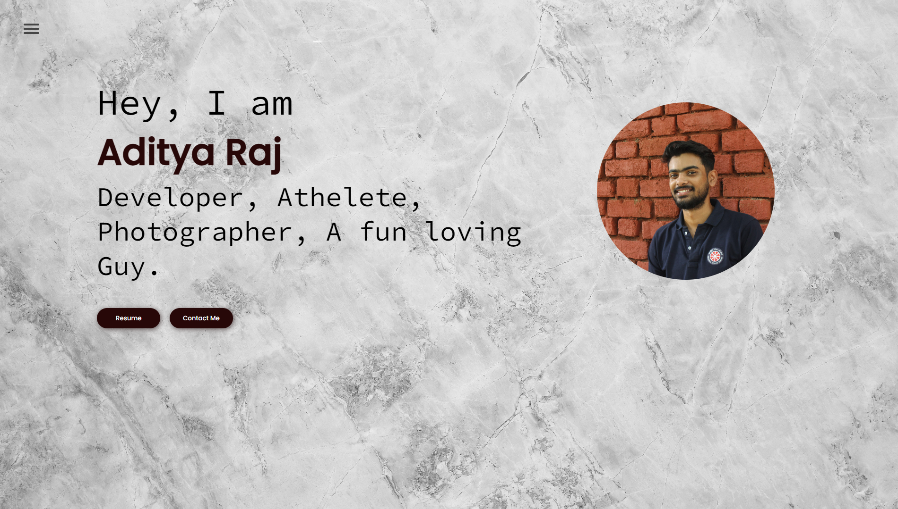
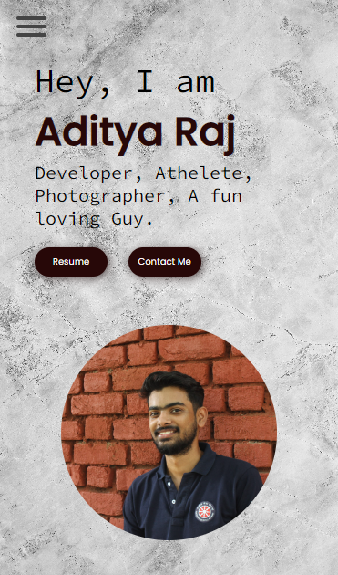
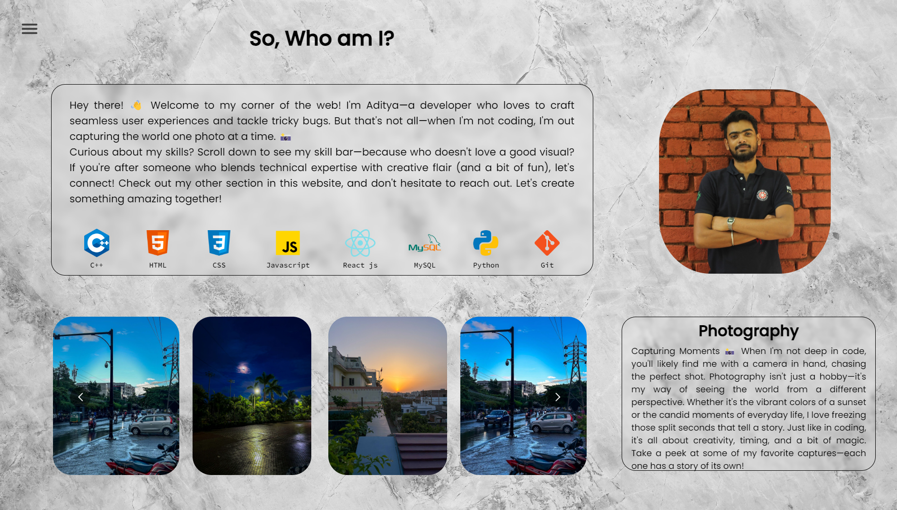
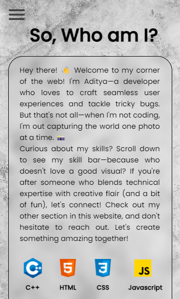
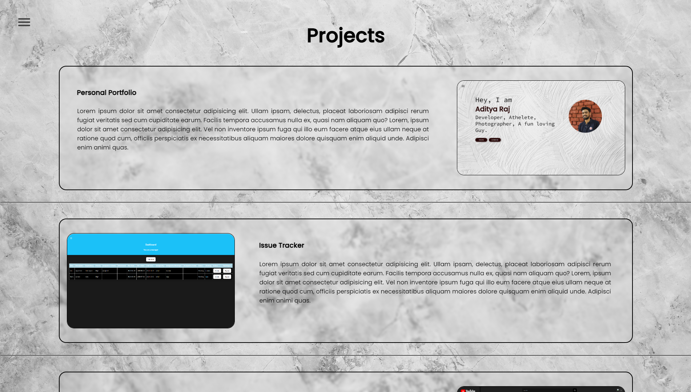
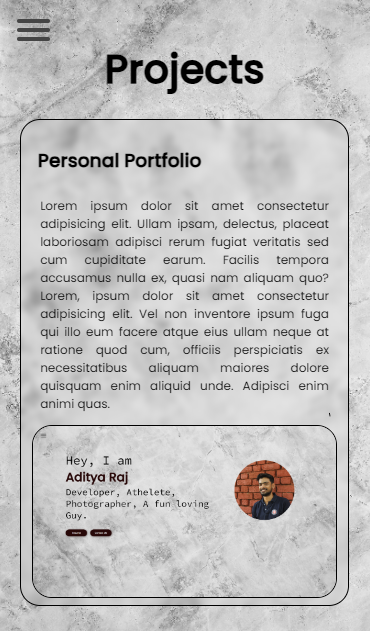
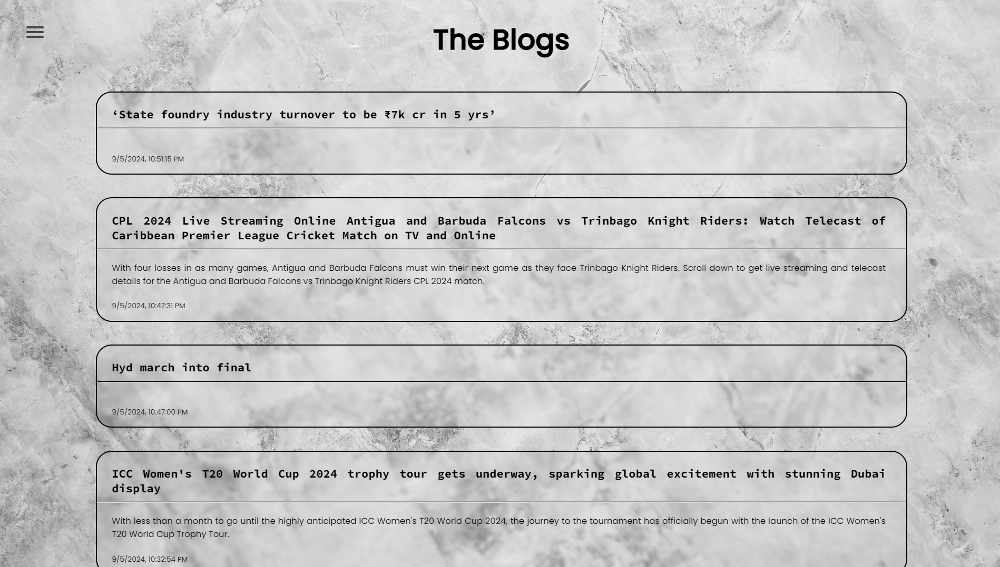
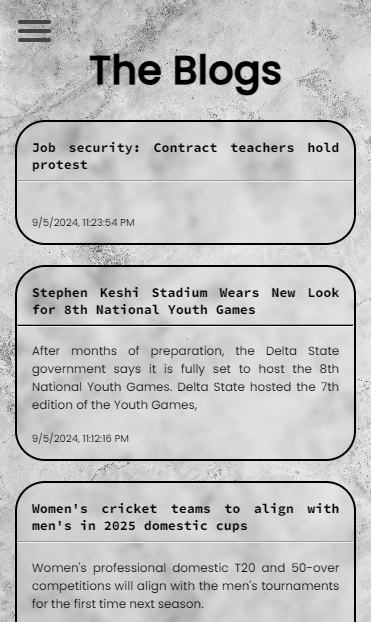
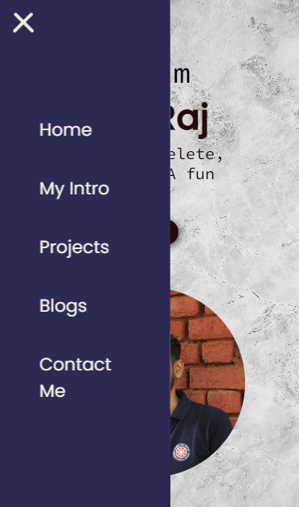

# Personal Portfolio

**Hey there! Welcome to this corner of the repository. Let me drive you through my Personal Portfolio website in a glimpse and tell you what techologies i've used!!**

*So lets get started!!!!*

I developed my personal portfolio website using React.js to showcase my skills as a *Frontend Developer.*

When building the website, I focused on creating a dynamic, component-based architecture using React.js. ensuring <u>scalability and maintainability</u>, used <u>reusable components</u> to improve efficiency and keeping the codebase clean. Incorporated React hooks like useState and useEffect to manage state and handle API calls, enabling smooth user interactions and dynamic content.

Aiming for a clean, minimal design, I applied my CSS skills to design a responsive and visually appealing layout and implemented <u>media queries</u> to ensure my portfolio looks great on any screen size. 

Deploying is where I gained experience in <u>web hosting and continuous integration</u> tools. Seeing my portfolio live and accessible was rewarding, and it allowed me to present my skills in a polished, professional manner. 

This project was a great opportunity to demonstrate my ability to build a user-friendly, performant web application from start to finish.

## Technologies Used
- HTML5
- CSS3
- Javascript 
- React.js
- VS Code Editor
- Chrome js and console Engine
- Node.js
- Version control - Git/GitHub
- Netlify

>### [Here's the link to my website](https://adityarj-portfolio.netlify.app/)

<!-- >**Homepage**
  

>**My Intro**

>**Projects**

>**Blogs**

>**Contact Me**

>**Hamburger Menu**

>**Footer**
 -->

>**Homepage**

  

>**My Intro**

  

>**Projects**

  

>**Blogs**

  

>**Contact Me**

 

>**Ham Menu**

  

>**Footer**

  